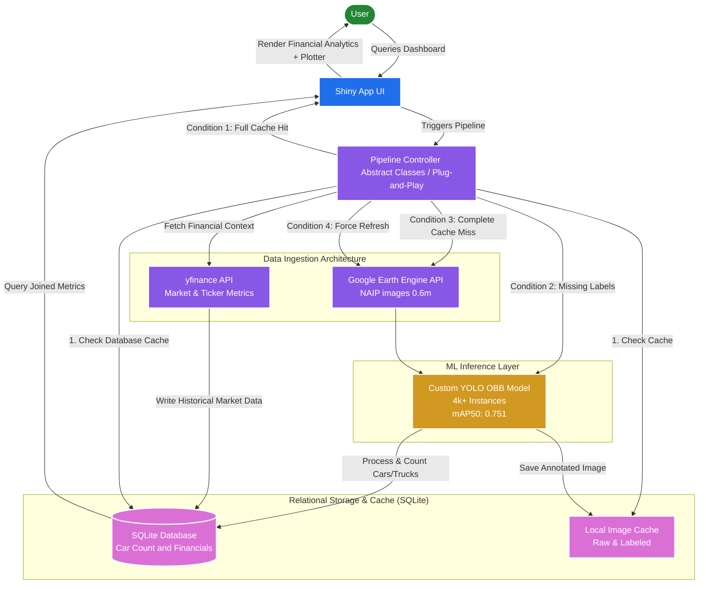

# Satalyze

Welcome to Satalyze! This library provides an end-to-end automated pipeline for downloading cloud satellite imagery, processing it via computer vision, combining financial metrics insights, and generating vehicle tracking telemetry logs.

---



## Installation

You can install the library directly from your terminal:

```bash
pip install satalyze
```

---

## How to Use

There are **two ways** to interact with this pipeline depending on your workflow.

### 1. The Code Pipeline (For Developers)

Import the core orchestrator class directly into your scripts or Jupyter Notebooks to run automated batches:

```python
from satalyze import SatelliteTrafficPipeline

# Initialize the pipeline
traffic_pipeline = SatelliteTrafficPipeline(project_id="satalyze") # REPLACE 'satalyze' with your project ID.

# Run analysis on a target location (Example: King of Prussia Mall Parking Lot)
traffic_pipeline.run(
    center_coordinates=[-75.3947, 40.0890], # [Longitude, Latitude] # Location of your parking lot
    start_date="2018-01-01", # start date of when you want to see images (NAIP data runs every 2-3 years on average)
    end_date="2022-12-31", # End date, unless there is recent NAIP data most recent dates wil be from 2023, important to manage your time window
    limit=2 # how many images you want from this place and timeframe
)
```

### 2. The Interactive App UI (For Visual Navigation)

If you prefer a visual interface, launch the built-in Streamlit dashboard. It includes an interactive map with an integrated address search bar, date pickers, and visual counters:

```python

# Launch the visual dashboard interface
satalyze-start
```

---

## Features

- **Google Earth Engine Integration**: Automatic spatial patch downloads.
- **YOLO + SAHI Machine Learning Layers**: Sliced object detection for ultra-high-resolution targets.
- **Interactive Geocoder Map**: Search for addresses or click anywhere on the globe to grab raw coordinates.
- **Auto-Generating Analytics**: Renders live data tables and futuristic timeline graphics instantly.

## License

This project is licensed under the GNU Affero General Public License v3.0 (AGPL-3.0). See the [LICENSE](LICENSE) file for details.
